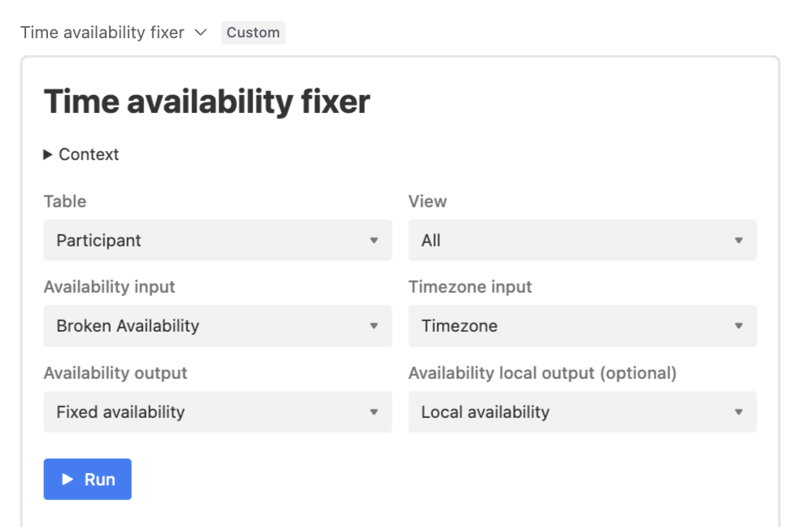

_This product is archived. This means we no longer use or develop it._

---

# time-availability-fixer

An Airtable extension to invert an offset for a given time availability. For example 'UTC-01:00' + 'M11:00 M12:00' → 'M13:00 M14:00'.

On 2023-01-17 we discovered facilitator and participant availabilities had been recorded incorrectly. Where availabilities had been entered in a particular timezone, the offset had been inverted.

For example, an availability entered in UTC-01:00 as 'M12:00 M13:00' should have been converted to 'M13:00 M14:00', but was instead converted to 'M11:00 M12:00'.

This AirTable extension undoes that conversion, given a time availability string (e.g. 'M12:00 M13:00, M14:00 M15:00') and a timezone (e.g. 'UTC-01:00').
